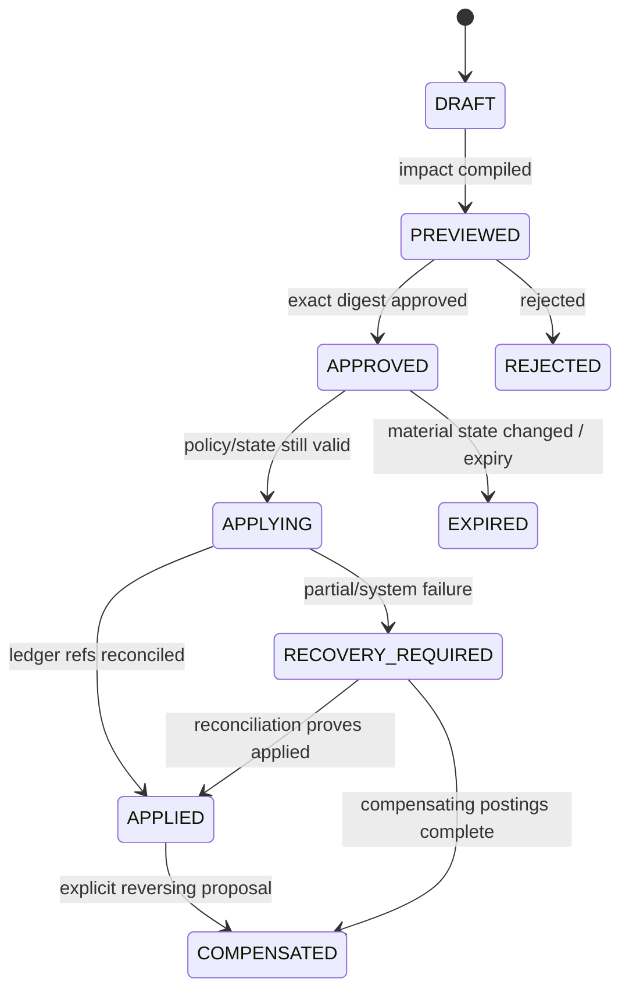

# Product Capital — локальная предметная область

> **Основа и reuse текущей редакции:** [локальная карта внешних компонентов и адаптеров](DEVELOPMENT.md#implementation-basis). Там указаны источник, режим использования, наши модули/пути, задачи и ограничения. Кандидат не установленная зависимость; этот предметный документ не требует реализации библиотечной механики с нуля.


**r15.11 · документальная передача владельцу; новых модулей/задач не добавлено.** Перенесён Portfolio & Capital Context из общей модели Stack. Каталог ниже сохраняет старые gate-имена; фактическая активация определяется текущим Issue. CAP-EXE/REC/SAFE — Product фасады и projections; фактические execution state machines остаются у EXE-*. CAP-LED и EXC-CLR — разные виды учёта.

<a id="capital-scope"></a>
## 15. Portfolio & Capital Context (`capital-core`)

### 15.1 Ответственность и автономность

Portfolio & Capital организует собственный капитал пользователя в Portfolio и
Sleeves, ведёт authoritative Capital Ledger, policies, benchmarks и attribution.
Он принимает validated, external или discretionary strategies и работает без
обязательного Investigation/Discovery runtime.

Он не размещает orders: capital/execution intent передаётся Policy & Execution.

### 15.2 `Portfolio` aggregate

Portfolio владеет:

- base/reporting currencies;
- Portfolio Policy ref;
- Benchmark Policy;
- Sleeve refs и portfolio-level limits;
- Reserve Policy ref;
- target isolation requirements;
- lifecycle/status;
- attribution configuration.

```text
DRAFT → ACTIVE → PAUSED → ACTIVE
            └→ CLOSING → CLOSED
```

Закрытие Portfolio требует reconciliation и отсутствия unresolved capital/order
state; оно не удаляет Ledger/history.

### 15.3 `Sleeve` aggregate

Sleeve — доменный отсек; UI может называть его Node.

| Состав | Смысл |
|---|---|
| `Mandate` | Objective, markets/instruments, horizons, style and constraints |
| `StrategyAssignment[]` | Exact validated/external versions либо explicit discretionary mandate |
| `RiskBudget` | Exposure/leverage/loss/drawdown/liquidity/concentration limits |
| `ExecutionBindingRef[]` | Venue/account/subaccount mapping and actual isolation |
| `benchmarkRef` | Optional sleeve-level reference benchmark |
| `status` | `DRAFT`, `ACTIVE`, `GUARDED`, `PAUSED`, `CLOSING`, `CLOSED` |

Allocation balance не хранится как независимо изменяемый Sleeve field: он
выводится из Capital Ledger. Это исключает две competing truths.

`GUARDED` разрешает только заранее определённые risk-reducing actions. Guard не
увеличивает Risk Budget и не выполняет cross-Sleeve reallocation.

### 15.4 `StrategyAssignment`

Assignment pin-ит:

- `ValidatedStrategyVersionRef`, `ExternalStrategyVersionRef` или
  `DiscretionaryMandateRef`;
- allowed instruments/environment;
- effective time range;
- Sleeve/Mandate/Risk Budget revisions;
- activation state;
- source promotion/proposal/approval refs.

Imported/manual position/logic явно маркируется; она не получает статус
validated systematic strategy.

### 15.5 `CapitalLedger` aggregate

Capital Ledger — double-entry authoritative source internal available,
reserved и allocated capital.

#### Основные accounts

| Account kind | Назначение |
|---|---|
| `EXTERNAL_CLEARING` | Reconciled venue/broker balance boundary |
| `AVAILABLE` | Доступный неаллоцированный capital |
| `SLEEVE_ALLOCATED` | Capital конкретного Sleeve |
| `SLEEVE_RESERVED` | Reserved for approved/pending action |
| `PORTFOLIO_RESERVE` | Reserve, не trading capital |
| `FEES`, `FUNDING`, `REALIZED_PNL` | Attribution/posting categories |
| `RECONCILIATION` | Explicit discrepancy resolution, не silent overwrite |

#### Ledger transaction

Каждая transaction имеет `transactionId`, source event, effective/recorded time,
currency/asset, postings, actor/system cause, environment и audit refs.

Для каждого asset/currency сумма debit и credit postings равна нулю. Posting
без Sleeve либо explicit system/reserve account запрещён. Update/delete posting
запрещены; correction — compensating transaction.

### 15.6 Allocation и Reserve

- Allocation изменяется ledger transaction, созданной только из approved
  `CapitalChangeProposal`.
- Один capital unit не может одновременно оставаться AVAILABLE/RESERVE и быть
  учтённым в нескольких Sleeves.
- Reserve становится trading capital только после explicit authorised transfer.
- Target allocation/policy и actual ledger balance различаются; UI показывает
  оба при расхождении.

### 15.7 `CapitalChangeProposal` aggregate

Используется для Allocation, Reserve Policy, Risk Budget, Strategy Assignment,
Execution Binding и rebalance changes.



Undo capital action не стирает postings. Он создаёт compensating proposal и
ledger transaction.

### 15.8 `ExecutionBinding`

Execution Binding отображает Sleeve на venue/account/subaccount/custody:

- requested и achieved `IsolationMode`;
- supported order/margin/position semantics;
- credential/account refs;
- environment;
- netting/cross-margin limitations;
- reconciliation scope;
- effective version.

`Sleeve = subaccount` не является правилом. Если venue даёт только shared
margin, фактический mode не может отображаться как `ACCOUNT_SEGREGATED`.

### 15.9 `Position` projection/aggregate

Position представляет internal reconciled view фактической/paper позиции:

- venue/account/environment/instrument identity;
- quantity, average/open values и venue-reported fields;
- fill/funding/fee refs;
- Sleeve/Strategy Assignment/Thesis refs;
- `IMPORTED`, `MANUAL`, `SYSTEMATIC` origin label;
- reconciliation timestamp/status и discrepancy refs.

Venue/broker остаётся источником внешнего факта. Position state меняется только
из reconciled fill/snapshot event; user/Agent не редактируют quantity напрямую.
Position без Thesis допустима и явно маркируется imported/manual.

### 15.10 `BenchmarkPolicy` и `PerformanceAttribution`

Benchmark Policy обязательно содержит:

- `CASH`;
- релевантный passive hold/reference portfolio;
- rebalance/cost/currency methodology;
- effective time range.

Performance Attribution — immutable report по exact Portfolio/Ledger/market
revisions. Он включает fees, funding, slippage, cash drag, Sleeve contribution,
factor/regime decomposition где методология валидна, и сравнение с benchmarks.

### 15.11 Commands и events

| Command | Guard | Event |
|---|---|---|
| `CreatePortfolio` | owner/tenant/base currency/benchmark policy valid | `PortfolioCreated` |
| `CreateSleeve` | Mandate/Risk Budget explicit; unique ID | `SleeveCreated` |
| `DraftCapitalChangeProposal` | exact source/target revisions and impact scope | `CapitalChangeProposed` |
| `ApproveCapitalChangeProposal` | user/policy approval over exact digest, not stale | `CapitalChangeApproved` |
| `BeginCapitalChangeApplication` | current state unchanged; balanced posting plan/reservations prepared | `CapitalChangeApplicationStarted` |
| `PostLedgerTransaction` | postings balanced; source/idempotency/account scopes valid | `LedgerTransactionPosted` |
| `ConfirmCapitalChangeApplied` | all required ledger/object refs reconciled | `CapitalChangeApplied` |
| `MarkCapitalChangeRecoveryRequired` | partial/system failure has observable refs | `CapitalChangeRecoveryRequired` |
| `TransferReserve` | approved proposal; source reserve balance sufficient | `ReserveTransferred` |
| `AssignStrategyVersion` | exact immutable version; mandate/risk compatible | `StrategyVersionAssigned` |
| `BindExecutionAccount` | capabilities/isolation/environment explicit | `ExecutionBindingCreated` |
| `ReconcileExternalCapital` | venue evidence pinned; discrepancy explicit | `CapitalReconciled` |
| `ReconcilePosition` | venue order/fill/snapshot refs fresh; origin/binding explicit | `PositionReconciled`/`PositionDiscrepancyDetected` |
| `GuardSleeve` | policy-defined risk deterioration; only reduce/exit allowed | `SleeveGuarded` |
| `PublishPerformanceAttribution` | ledger complete; benchmark/methodology pinned | `PerformanceAttributionPublished` |

### 15.12 Локальные guards

- Ledger always balances; no orphan posting.
- Capital is never double allocated.
- Reserve requires explicit ledgered transfer.
- Portfolio Policy dominates Sleeve Policy.
- Strategy Assignment pins exact immutable version.
- Discretionary/imported logic remains labelled.
- Achieved isolation cannot be overstated.
- Venue fact is reconciled; internal projection is not silently overwritten.
- Guard only reduces/exits and never reallocates automatically.
- Attribution includes benchmarks and all material costs.
- Export covers Portfolio, Ledger, assignments and observable decision history.

**Связанные инварианты:** `CAP-001`–`CAP-013`, `RES-008`, `SYS-004`.

---

### 5.5 `capital-core`

| ID / module | Gate | Authoritative responsibility |
|---|---|---|
| `CAP-LED capital-ledger` | CAPITAL | Double-entry capital/fill/funding/fee/reserve postings |
| `CAP-PORT portfolio-sleeves` | CAPITAL | Portfolio, Sleeve, Mandate, bindings и strategy assignments |
| `CAP-ATTR allocation-attribution` | CAPITAL | Ledger-derived allocation, benchmarks и performance attribution |
| `CAP-RISK risk-policy` | CAPITAL/PAPER | Risk budgets, mandates, aggregate exposure and deterministic decisions |
| `CAP-APP proposal-approval` | CAPITAL/PAPER | Capital/Execution proposals, explicit approval and ApprovedIntent |
| `CAP-EXE execution-gateway` | PAPER/LIVE | Environment-bound order intent and venue execution adapter boundary |
| `CAP-REC reconciliation` | PAPER/LIVE | Orders, fills, positions, venue/internal ledger reconciliation |
| `CAP-SAFE safety-control` | PAPER/LIVE | Independent kill switch, pause and recovery authorization |

Группа DORMANT до соответствующего gate; ранний read-only build физически не содержит live
execution adapter или trading credentials.

---
<!-- R159 paper-facades -->
## Текущая активация PAPER-фасадов

CAP-EXE/CAP-APP/CAP-REC активны только в части существующих Research/PAPER привязок PRD-020/021. Это не включает весь Capital OS и не создаёт отдельный OMS/ledger для generic агента. AgentRegistry и approvals принадлежат Product Agent lifecycle; Execution выполняет общую симуляцию.

BenchmarkPolicy/alpha — исследовательские показатели, не автоматический допуск к Node или реальному исполнению. Validation profile фиксирует coverage/version/failure evidence; прибыльность не заменяет проверку инвариантов.
